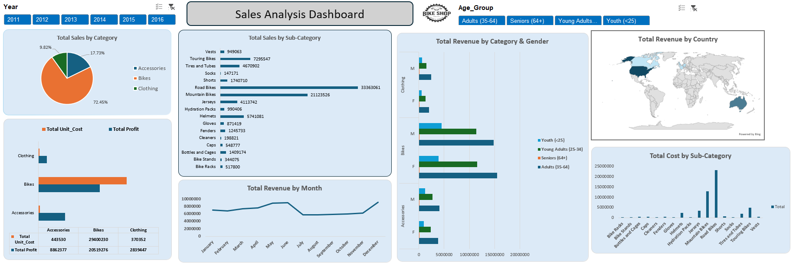

# 📊 Sales Analysis Dashboard — Microsoft Excel

## Project Overview
Interactive Sales Analysis Dashboard built in Microsoft Excel
for a Bike Shop business covering 6 years of data (2011–2016).

## 📸 Dashboard Preview

## 🔍 Key Insights
- Bikes drive 72% of total revenue
- Road Bikes alone generated $33M+ in revenue
- Bikes total profit: $20,519,276
- Accessories total profit: $8,862,377
- Clothing total profit: $2,839,447

## 📊 Visualizations
- Pie chart — Total Sales by Category
- Bar chart — Unit Cost vs Profit by Category
- Horizontal bar — Sales by Sub-Category (15+ products)
- Line chart — Total Revenue by Month
- Grouped bar — Revenue by Gender & Age Group
- World Map — Total Revenue by Country
- Bar chart — Total Cost by Sub-Category

## 🎛 Interactive Features
- Year filter (2011–2016)
- Age Group filter
- Dynamic slicers

## 🛠 Tools Used
Microsoft Excel · Pivot Tables · Power Query · 
Slicers · Data Visualization · Conditional Formatting
